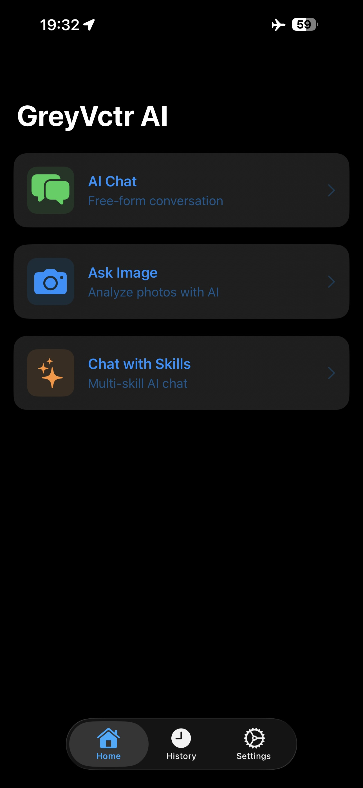
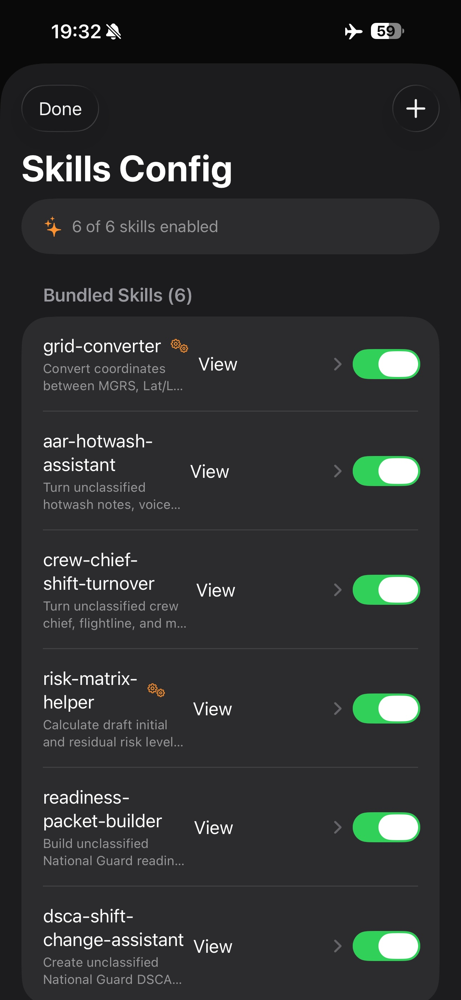
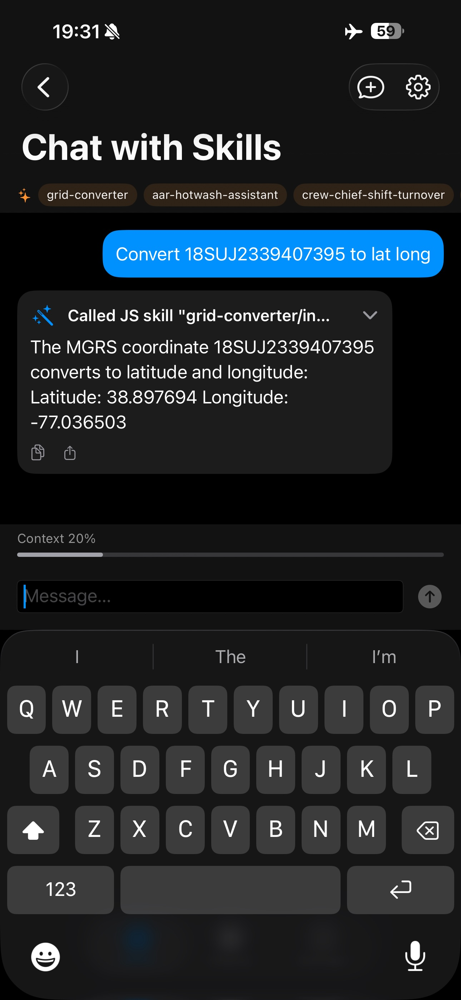
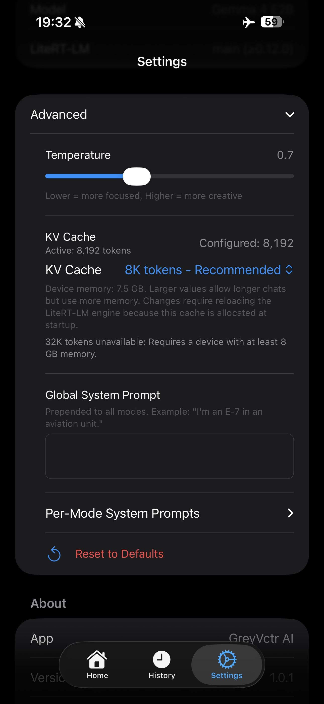
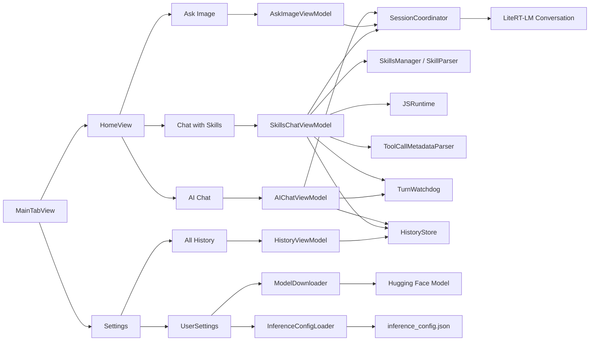

# GreyVctr AI

On-device AI assistant for the National Guard. Runs local inference on iOS using [LiteRT-LM](https://github.com/google-ai-edge/LiteRT-LM) with the [Gemma 4 E2B](https://huggingface.co/litert-community/gemma-4-E2B-it-litert-lm) model. No cloud inference, no accounts, and prompts, images, and generated responses stay on the device.

> **Community project.** Not official, not endorsed by DoD, NGB, the Army, the Air Force, Google, or any state National Guard organization.

## Screenshots

<p align="center">
  
  
  
  
</p>

## Features

- **AI Chat** — Multi-turn conversation with the on-device LLM, with throttled real-time token streaming, bounded live transcript rendering, and a stop button
- **Ask Image** — Multimodal visual Q&A using the device camera or photo library
- **Chat with Skills** — Gallery-style Agent Skills chat using bundled `SKILL.md` files (shift turnovers, SITREPs, readiness checklists, risk matrices, AARs, coordinate conversions). The app keeps the skill layer generic, includes bounded recent context for follow-up questions, hides intermediate routing text, executes JS-backed skills locally through JavaScriptCore, and keeps the active chat surface lightweight by showing only the most recent turns while saving the full transcript in History.
- **Skills Config** — Enable/disable skills, view skill instructions and JavaScript source, import custom skills from device storage
- **Multi-turn conversations** — AI Chat reconstructs bounded context from the active transcript for each send. AI Chat and Chat with Skills keep the active screen bounded to recent turns while preserving the full reviewable transcript in History.
- **Token streaming** — Model responses stream to the UI with a stop button to cancel generation. AI Chat displays streaming tokens as plain text with throttled UI updates and keeps completed active-chat responses as plain text. Full Markdown/LaTeX rendering is available in History and other formatted response surfaces. Chat with Skills uses a collapsible ThinkingBubble during inference that starts collapsed ("Thinking…") and can be expanded to watch raw tokens.
- **Skill discovery** — Users can ask "What skills do you have?" in Chat with Skills and the model responds with the enabled skill catalog, since skill names and descriptions are part of the system prompt context.
- **Configurable engine backend** — Automatic, GPU (Metal), and CPU backend settings. Automatic uses GPU-first fallback on physical devices; the iOS Simulator is forced to CPU so simulator testing is possible.
- **Markdown + LaTeX rendering** — History and other formatted response surfaces render with GitHub-flavored Markdown (headers, lists, code blocks, tables) and LaTeX math when the renderer supports the model output, with ordinary currency values such as `$25` left as text. The active AI Chat view deliberately uses plain text only for reliability.
- **Copy/Share** — Every model response has copy and share buttons for easy export
- **Conversation history** — AI Chat and Chat with Skills are saved as conversation-level history entries. Each chat mode has an in-chat history picker for resume/delete, and Settings → Data → All History provides search, copy/share, per-entry delete, and Clear All across saved conversations.
- **Configurable** — Temperature, backend preference, KV cache size, system prompts, and per-mode overrides via `inference_config.json` or in-app Settings

## Architecture

```
┌─────────────────────────────────────────┐
│              SwiftUI Views              │
│  HomeView · AIChatView · AskImageView   │
│  SkillsChatView · SkillsConfigView      │
│  ChatBubble · SkillToolCallIndicator    │
│  ThinkingBubble                         │
│  HistoryList/Detail · SettingsView      │
├─────────────────────────────────────────┤
│             ViewModels                  │
│  AIChatVM · SkillsChatVM · HistoryVM    │
│  TurnWatchdog (actor)                   │
├─────────────────────────────────────────┤
│           Core Services                 │
│  SessionCoordinator (actor)             │
│  SkillParser · SkillsManager            │
│  InferenceConfigLoader · JSRuntime      │
│  HistoryStore · ConversationStore       │
│  BackgroundInferenceGuard               │
│  ToolCallMetadataParser                 │
│  ModelDownloader · KVCacheMemoryPolicy  │
├─────────────────────────────────────────┤
│   Official LiteRT-LM Swift SDK (SPM)    │
│  Engine (actor) · Conversation          │
│  Message · sendMessage/sendMessageStream│
│  GPU Metal / CPU · Multi-turn KV cache  │
├─────────────────────────────────────────┤
│         On-Device Storage               │
│  Gemma 4 E2B model (downloaded)         │
│  Bundled SKILL.md files                 │
│  SwiftData chat history · UserDefaults  │
└─────────────────────────────────────────┘
```



## Dependencies

| Dependency | Purpose | License |
|-----------|---------|---------|
| [LiteRT-LM](https://github.com/google-ai-edge/LiteRT-LM) | Google's official Swift SDK for on-device LLM inference. Integrated via SPM (`revision:` pinned to commit `a0afb5a` on the v0.13.1 line). Uses `revision` instead of version tag because the project has historically had LFS/package-resolution churn. Provides Engine actor, Conversation class, Tool protocol with `@ToolParam` property wrapper, multi-turn KV cache, token streaming, and GPU Metal acceleration. | Apache 2.0 |
| [Gemma 4 E2B](https://huggingface.co/litert-community/gemma-4-E2B-it-litert-lm) | On-device LLM model (~2.6 GB, downloaded at runtime) | Apache 2.0 |
| [Guard Skills](https://github.com/GreyVctr/google-ai-edge-guard-skills) | National Guard skill definitions (bundled, with local README/format adjustments for this app) | Apache 2.0 |
| [swift-markdown-ui](https://github.com/gonzalezreal/swift-markdown-ui) | Primary GitHub-flavored Markdown renderer for model responses | MIT |
| [LaTeXSwiftUI](https://github.com/colinc86/LaTeXSwiftUI) | LaTeX math equation renderer for math-containing response blocks | MIT |

## Requirements

- iOS 26.0+
- iPhone 13 Pro or later (6 GB+ RAM required for Gemma 4 E2B)
- Xcode with the iOS 26 SDK
- ~3 GB free storage for the model download

## Getting Started

### 1. Clone and build

```bash
git clone https://github.com/GreyVctr/GreyVctr-AI.git
cd GreyVctr-AI/GreyVctrAI
xcodegen generate
GIT_LFS_SKIP_SMUDGE=1 swift package resolve
open GreyVctrAI.xcodeproj
```

> Requires [XcodeGen](https://github.com/yonaskolb/XcodeGen) (`brew install xcodegen`). The `.xcodeproj` is generated from `project.yml` — run `xcodegen generate` after cloning or adding/removing source files.
>
> The `GIT_LFS_SKIP_SMUDGE=1` flag is required because LiteRT-LM's repo uses Git LFS for prebuilt dylibs, and GitHub's LFS storage intermittently fails to serve these objects. The actual xcframework used by the build is separate from the LFS-tracked files.

### 2. Configure signing

In Xcode: select the **GreyVctrAI** application target (display name: GreyVctr AI) → **Signing & Capabilities** → select your development team.

> **Note on the team ID:** `project.yml` pins `DEVELOPMENT_TEAM` to the original author's Apple Team ID, which gets baked into the generated `.xcodeproj`. This isn't a secret (Apple Team IDs ship in every distributed app's code signature), but you must set your own to build and sign: change `DEVELOPMENT_TEAM` in `project.yml` and re-run `xcodegen generate`, or just pick your team in Xcode's Signing & Capabilities tab.

### 3. Build and run

Select your iPhone as the destination and hit Run. On first launch, the app will:
1. Download the Gemma 4 E2B model (~2.6 GB) from Hugging Face
2. Initialize the LiteRT-LM engine using the configured backend
3. Present the main UI with three modes

The app can also run in the iOS Simulator for CPU-only testing. The simulator can exercise UI, model download, CPU backend initialization, AI Chat, Ask Image UI flows, and Chat with Skills behavior, but performance will be lower than a physical GPU-capable iPhone.

## How It Works

### AI Chat

AI Chat uses the LiteRT-LM `Conversation` API with `sendMessageStream()` for real-time token streaming. Each send starts a fresh LiteRT conversation so stop/reply cycles do not inherit a dirty live session. Continuity comes from bounded transcript replay: before a new send, the view model reconstructs just enough prior context to fit within the configured KV cache size minus reserves for the system prompt and response.

During streaming, AI Chat keeps the active token stream outside the saved transcript array and renders it as a separate plain `Text` bubble. Streaming UI updates are throttled to reduce SwiftUI diff/layout churn while preserving a final flush of the full response. When the turn completes or is stopped, the final assistant text is committed to the transcript in one batched MainActor update. The active AI Chat surface shows only the most recent turns, with earlier turns preserved in History for full review.

A `TurnWatchdog` actor (detached at high priority) monitors token progress with adaptive timing. The first-token timeout scales from 45 to 180 seconds based on estimated context pressure, while post-token stall timeout scales from 30 to 90 seconds. If the LiteRT-LM engine hangs — which can happen intermittently on longer replay prompts — the watchdog fires, force-releases the conversation, and shows a recovery message.

When the user changes temperature, system prompt, or other generation settings, the next request uses the updated config automatically because AI Chat already creates a fresh conversation per send.

### Ask Image

Ask Image uses the LiteRT-LM multimodal `Conversation` API. Each analysis is single-turn — a fresh conversation is created for every image submission. The view constructs a `Message` with `.imageData(Data)` and `.text(String)` content parts, sends it via `sendMessage()` (non-streaming), and displays the result with full Markdown/LaTeX rendering.

The camera and photo library are both supported via `PhotosPicker` and a custom `CameraImagePicker` using `UIImagePickerController`. Image data is passed as raw JPEG/PNG bytes; the SDK handles decode, resize, and patchification internally.

Ask Image results are currently not saved to History. The result remains on the active Ask Image screen until the user leaves or starts another analysis.

### Chat with Skills

Chat with Skills follows the Google AI Edge Gallery Agent Skills pattern, but uses text-mode skill routing rather than native LiteRT-LM `Tool` objects. This keeps skills data-driven and importable, and sidesteps a nested-JSON tool-call parser issue in LiteRT-LM (since resolved via constrained decoding). The app loads bundled `SKILL.md` files, injects the enabled skill catalog plus bounded recent transcript context into the prompt, and lets the model choose or continue with the relevant skill. JS-backed skills are executed asynchronously through JavaScriptCore after the model returns a JSON payload.

Chat with Skills uses `sendMessageStream()` for real-time token streaming with an 80ms throttled UI update, a `TurnWatchdog` actor with adaptive first-token and post-token stall timing, and a structured `Task` with stored reference for proper cancellation propagation. Each turn creates a fresh conversation (`forceNew: true`) to avoid KV cache accumulation issues. The `BatchedUpdate` pattern ensures all terminal state mutations (streaming content, generation status, messages, context estimate) are applied in a single MainActor block for smooth UI updates.

The flow:
1. The enabled skill catalog is injected using each skill's name, type, and description
2. The recent visible transcript is bounded and included so follow-up prompts can refer to prior turns
3. The model selects the relevant skill, or continues with the selected skill when one is active
4. The app strips any skill/tool metadata from the response via `ToolCallMetadataParser`
5. For JS-backed skills, the app parses the JSON payload and executes the skill asynchronously via `JSRuntime` (continuation-based, 10-second timeout)
6. For text skills, the app displays the final answer directly
7. Users can ask "What skills do you have?" and the model responds with the enabled skill catalog from the system prompt — no special handling needed since the skill names and descriptions are already in the prompt context

During generation, a collapsible `ThinkingBubble` shows a spinner with "Thinking…". Users can tap to expand and watch raw model tokens streaming in real-time. After inference completes, the thinking bubble is replaced with the final answer bubble. If a skill was used, the skill indicator badge above the message can be tapped to reveal the raw JSON the model produced — useful for debugging model output quality issues.

## Configuration

### Markdown and LaTeX rendering

Formatted response surfaces are rendered through `MarkdownText`, which uses `MarkdownUI` as the default renderer. Pure Markdown responses stay as one GitHub-flavored Markdown document so headings, lists, code blocks, tables, links, and blockquotes keep native Markdown behavior.

When a response contains math delimiters, the renderer splits the response into Markdown blocks and LaTeX blocks. Only blocks containing math are routed through `LaTeXSwiftUI`; surrounding Markdown continues to use `MarkdownUI`.

The active chat surfaces intentionally handle display differently:

- **AI Chat** — During token streaming, a separate plain `Text` bubble shows the active response with throttled UI refreshes. When the stream completes, the final response is committed to the transcript as plain text. Full Markdown/LaTeX rendering is available in History.
- **Chat with Skills** — Uses a collapsible `ThinkingBubble` during generation. The bubble starts collapsed showing "Thinking…" with a spinner; users can tap to expand and watch raw tokens. After inference completes, the thinking bubble is replaced with the final answer bubble. Skill-used outputs show a skill indicator and may use plain/collapsible text; non-skill model replies can use Markdown rendering.
- **History** — Conversation review uses Markdown plus best-effort LaTeX for standard equations. It does not repair malformed model output or apply chemistry-specific rendering workarounds.

| Surface | Streaming display | Completed active display | History/review display |
|---------|-------------------|--------------------------|------------------------|
| AI Chat | Plain SwiftUI `Text` | Plain SwiftUI `Text` | Markdown + best-effort LaTeX |
| Chat with Skills | Collapsible `ThinkingBubble` with raw tokens | Final answer bubble; skill-used outputs may be plain/collapsible | Markdown + best-effort LaTeX |
| Ask Image | Non-streaming | Markdown + best-effort LaTeX | Not currently persisted |

If the user taps Stop during a streaming response in either mode, the UI immediately enters a stopping state while LiteRT-LM unwinds cancellation. A `TurnWatchdog` actor automatically cancels stalled inference in both modes using adaptive first-token and post-token stall timing.

Recognized math delimiters:

- Inline math: `$...$` and `\(...\)`
- Block math: `$$...$$` and `\[...\]`

The detector ignores escaped dollar signs and common currency values such as `\$25`, `$25`, and `$5`. Chemical formulas are not special-cased by the renderer. The AI Chat system prompt asks the model to emit chemical formulas as plain text, for example `H2O`, `CO2`, `Fe2O3`, and `C17H19NO3`, rather than LaTeX.

### inference_config.json

Located at `Sources/Resources/inference_config.json`. Controls sampler parameters, prompt settings, and developer flags:

```json
{
    "defaults": {
        "temperature": 0.3,
        "top_k": 40,
        "top_p": 0.95,
        "system_prompt": ""
    },
    "check_for_model_updates": false,
    "modes": {
        "ask_image": {
            "system_prompt": ""
        },
        "ai_chat": {
            "system_prompt": "Helpful on-device assistant prompt; asks for plain chemical formulas."
        },
        "chat_with_skills": {
            "system_prompt": "Agent Skills prompt with ___SKILLS___ placeholder"
        }
    }
}
```

Sampler settings such as `temperature`, `top_k`, and `top_p` are global defaults. Mode entries are used for behavior-specific prompts and may omit sampler fields to inherit the global values.

| Field | Default | Description |
|-------|---------|-------------|
| `check_for_model_updates` | `false` | Legacy developer flag for remote model metadata checks. The startup and Settings update prompts do not depend on this flag: GreyVctr AI always compares the installed model metadata against the app's target model commit and asks users to update when they are behind. |

`ai_chat.system_prompt` is the bundled default for plain conversational chat. At runtime, AI Chat appends the current local ISO-8601 date-time to the system message so the model has current-date context without hardcoding a stale date.

`chat_with_skills.system_prompt` follows the Google AI Edge Gallery Agent Skills pattern. The `___SKILLS___` placeholder is replaced at runtime with the enabled skill names and descriptions. In Settings → Advanced → Per-Mode System Prompts, each mode's editor shows that mode's bundled default prompt, lets you customize it, and provides Restore Default to return to the bundled prompt.

Settings → Advanced includes a Global System Prompt plus per-mode prompts for Ask Image, AI Chat, and Chat with Skills. The global prompt is prepended to all three modes. Each per-mode prompt applies only to its matching mode and is appended after that mode's bundled default when set.

Global and per-mode prompt changes apply on the next request. If AI Chat or Chat with Skills already has a live conversation, GreyVctr AI starts a fresh underlying LiteRT-LM conversation with the updated prompt before sending that next request. Ask Image creates a fresh configured vision conversation for each analysis.

### Engine Backend

Settings -> Advanced -> Backend controls how the LiteRT-LM engine is initialized:

- **Automatic** — Default. On physical devices, the app tries full GPU first, then hybrid GPU text + CPU vision, then CPU. This gives the best available performance while preserving a fallback path.
- **GPU (Metal)** — Prefer the Metal backend on physical devices. If full GPU fails, the app still falls back through the hybrid and CPU paths so the app can recover.
- **CPU** — Use CPU only. This is slower, but useful for compatibility testing and simulator runs.

The iOS Simulator always runs CPU-only, even if Automatic or GPU is selected, because the LiteRT-LM Metal path is intended for physical iPhone hardware. Settings shows both the configured backend and the active backend. Backend changes apply after restarting the app so LiteRT-LM and Metal can construct a fresh engine without an in-process teardown/rebuild cycle.

The app still has an internal engine reload path for model updates and explicit error recovery, but Settings avoids live backend switching for reliability.

### Model Download

The Gemma 4 E2B `.litertlm` file is downloaded at runtime from Hugging Face and stored under Application Support. Downloads use the app's local `ModelDownloader` service with a background `URLSession` so they can continue across app lifecycle events.

GreyVctr AI tracks the installed model using a local metadata file that records the Hugging Face commit used for the download. The app target model is commit `3f25054`. If the local model is missing metadata or was installed from an older known commit such as `6e5c4f1`, Settings shows an available model update and asks the user to update.

> **Important**: Do not update the model commit or SDK revision independently. They must be tested together. The pinned pair is:
> - SDK: `a0afb5a` (v0.13.1 line)
> - Model: `3f25054`

Updating downloads the target model, replaces the local `.litertlm` file, and reloads the LiteRT-LM engine.

If Hugging Face or Xet returns a non-2xx response such as `HTTP 403`, the downloader clears stored resume data before marking the download failed. This prevents retries from repeatedly resuming against an expired redirected/signed URL. A subsequent retry starts from the stable Hugging Face model URL.

### KV Cache Size

The engine's KV cache size (context window) controls how much conversation history the model can reference. Default is 8192 tokens. Settings → Advanced → KV Cache supports 4096, 8192, 16384, and 32768 tokens. Larger values allow longer multi-turn conversations but use more memory.

GreyVctr AI uses total device memory as a guardrail for high-context options. The policy uses decimal GB to match Apple's marketed device memory classes: 4K and 8K are always available, 16K requires at least 6 GB of device memory, and 32K requires at least 8 GB. Unsupported sizes are shown as unavailable in Settings rather than hidden. The Low memory, Recommended, High memory, and Very high memory labels describe the cache size category; they do not change based on the device.

KV cache changes are applied when the LiteRT-LM engine starts. If the configured value differs from the active engine value, Settings asks the user to restart the app. This avoids tearing down and rebuilding the native LiteRT-LM engine during normal Settings use.

AI Chat and Chat with Skills show an estimated context usage meter above the message composer once a conversation starts. The app warns users at 70% capacity and shows a stronger warning at 90%, with a Start Fresh action in the chat warning. This approach was chosen over reactive detection (checking for short responses) or automatic truncation because:
- Guard personnel need reliable, predictable outputs — silent degradation is unacceptable
- Users should make the conscious decision to start fresh rather than having context silently dropped
- The warning gives users time to finish their current task before the model quality degrades

### Conversation Persistence

AI Chat and Chat with Skills keep the reviewable conversation in History. AI Chat reconstructs context from a bounded transcript when needed rather than relying on a reused live session, and both chat modes render only recent turns in the active chat surface. Chat with Skills remains a separate mode with its own runtime flow and injects bounded recent context into each skill-routing prompt. This keeps long conversations light enough for active chat while still preserving a durable record in History.

Resume is mode-specific: AI Chat and Chat with Skills expose their own history picker from the chat toolbar. Settings → Data → All History is the archive and deletion surface for saved conversations.

#### History integration

History mirrors the user-facing workflow: AI Chat and Chat with Skills update one history entry per active conversation, so prior user and assistant turns can be reviewed together. History stores the full conversation for review, including Skills turns that are no longer visible in the bounded active chat surface. Ask Image does not currently write history entries.

## Skills

Six Guard skills are bundled:

| Skill | Type | Use Case |
|-------|------|----------|
| `crew-chief-shift-turnover` | Text | Aviation maintenance passdown notes |
| `dsca-shift-change-assistant` | Text | DSCA shift handoffs, SITREPs |
| `readiness-packet-builder` | Text | Readiness and activation packet checklists |
| `risk-matrix-helper` | JS-backed | Risk matrix calculation with JavaScript |
| `aar-hotwash-assistant` | Text | After Action Reviews and hotwash notes |
| `grid-converter` | JS-backed | MGRS/Lat-Long/UTM coordinate conversion |

Chat with Skills follows the Google AI Edge Gallery Agent Skills pattern. The app treats skill files as lightweight, data-driven instructions rather than hardcoded app logic. Intermediate routing and tool-call text is hidden from the chat transcript; the UI shows streaming token progress during generation, then replaces it with the final answer bubble. Long skill-used responses are collapsed, and only recent turns are kept visible in the active chat. Follow-up prompts are allowed in the same active Skills Chat and receive bounded recent transcript context.

JS-backed skills use a Gallery-style text contract: the model emits a JSON payload for the selected skill, `ToolCallMetadataParser` normalizes the metadata, and `JSRuntime` runs the script asynchronously (via `withCheckedThrowingContinuation` on a dedicated queue with a 10-second timeout) before the app displays the final result. A `TurnWatchdog` actor monitors inference progress and uses adaptive timeouts to avoid indefinite stalls.

### Porting skills from Google AI Edge Gallery

The bundled skill definitions are derived from the [guard-skills repo](https://github.com/GreyVctr/google-ai-edge-guard-skills), licensed under Apache 2.0. This app keeps local copies with app-specific edits. If you're porting a skill from the Google AI Edge Gallery Android app, be aware of these differences:

| Aspect | Google AI Edge Gallery (Android) | GreyVctr AI (iOS) |
|--------|----------------------------------|-------------------|
| Tool calling | Native SDK `Tool` objects with `@ToolParam` | Text-based: model emits `[Using skill: X]` + JSON, app parses manually |
| JSON marshaling | SDK handles serialization/deserialization | App uses `ToolCallMetadataParser` + `extractRunJSData` + `repairTruncatedJSON` |
| Instruction length | Unlimited (system prompt per skill) | Text-only skills are compacted from their `## Instructions` section to about 1,600 characters; JS-backed skills keep their full instructions |
| Skill isolation | One skill active at a time, full instructions in context | All enabled skills injected simultaneously (catalog in system prompt) |
| JS execution | WebView-based | JavaScriptCore via `JSRuntime` (no DOM, no fetch, no setTimeout) |
| JS function signature | `window.ai_edge_gallery_get_result(dataStr)` returns Promise | Same — but Promise must resolve synchronously (no real async/await) |

**When porting a skill:**

1. **Keep instructions compact** — The app injects all enabled skill instructions into one system prompt. Text-only skills are compacted to about 1,600 characters, but JS-backed skill instructions are kept intact so their JSON contracts remain available. Long instructions consume KV cache budget and leave less room for the user message and response.
2. **Ensure the JS function is synchronous** — JavaScriptCore on iOS doesn't have a real event loop. `async function` is fine (it's just syntax), but don't use `await fetch(...)`, `setTimeout`, or any actual async I/O. The function body must compute and return immediately.
3. **No DOM or Web APIs** — `JSRuntime` creates a bare `JSContext` with only `window = this`. No `document`, `fetch`, `XMLHttpRequest`, `localStorage`, or `console.log`. Use pure computation only.
4. **Keep JSON payloads simple** — The model generates the JSON payload as text. Complex nested structures (arrays of objects with many fields) get truncated by the model's token limit. Prefer flat structures or short arrays. If your skill needs complex input, consider having the model call it multiple times with simpler payloads.
5. **Test with `inferJSInput` fallback** — For skills like grid-converter, we added regex-based input extraction (`inferJSInput`) that bypasses model-generated JSON entirely. If your skill has predictable input patterns, add a case to `inferJSInput` for more reliable execution.

The text-skill compaction is a development-time choice (not documented by Google) to keep the combined system prompt manageable when all 6 skills are enabled simultaneously, leaving headroom within the 8192-token KV cache for user messages and responses.

## Known Limitations

### SDK and Model Limitations

- **Single conversation at a time** — LiteRT-LM supports only one active conversation per engine instance. Switching between AI Chat, Chat with Skills, and Ask Image releases the previous mode's conversation and starts fresh. System prompts and skill-routing state do not leak across modes.
- **Skills streaming shows raw metadata during generation** — Chat with Skills uses a collapsible `ThinkingBubble` during inference. The bubble starts collapsed showing "Thinking…" with a spinner; users can tap to expand and watch the raw model tokens as they stream. After inference completes, the thinking bubble is replaced with the final answer bubble. This hybrid approach gives immediate feedback without exposing raw metadata by default.
- **Active transcripts are bounded** — AI Chat and Chat with Skills show only recent turns in the active chat surface. Full conversations are saved in History for review.
- **Model truncates complex JSON payloads** — When the model emits tool-call JSON for JS-backed skills, complex payloads (e.g., risk matrices with multiple hazards) are sometimes truncated because the model runs out of generation tokens. The app includes a `repairTruncatedJSON` heuristic that closes unclosed brackets and braces, but semantically incomplete JSON (missing array elements, truncated values) still fails in the JS runtime. The error is shown to the user, and the raw model output is viewable via the skill indicator badge. This is a fundamental limitation of text-based tool calling with small on-device models.
- **Model hallucination of tool calls** — Gemma 4 E2B occasionally emits malformed tool-call text or selects the wrong skill. `ToolCallMetadataParser` handles common malformed patterns (missing closing tags, `<|"|>` tokens, unquoted JSON keys). If parsing fails entirely, the raw response is shown to the user.

### Platform Limitations

- **GPU sessions don't survive background transitions** — iOS revokes Metal GPU execution permission when backgrounded. The app cancels active inference on `willResignActive`, but keeps the engine alive. On return to foreground, the existing engine is reused (no reload delay). On termination, the app lets iOS reclaim process memory instead of synchronously tearing down LiteRT-LM.
- **Engine reload on cold launch** — The engine loads once at app launch (~5–10s). It persists across background/foreground cycles. The active chat starts fresh on relaunch; full conversation review lives in History.
- **Simulator is CPU-only** — The app can run in the iOS Simulator, but the simulator forces the CPU backend. GPU/Metal testing still requires a physical iPhone.
- **First launch is slow** — Model download (~2.6 GB) + engine initialization (~30s on first run, ~10s on subsequent launches due to GPU compilation cache).

### Feature Limitations

- **Ask Image results are not persisted yet** — Ask Image analysis output is shown on the active screen only. Persisting image-analysis history should include enough context to avoid a misleading archive, ideally the prompt, generated response, and source image or thumbnail metadata.
- **Ask Image is single-turn only** — Each image analysis creates a fresh conversation. There is no multi-turn follow-up on a previous image analysis (e.g., "What about the text in the upper left?"). This is a deliberate simplification; multi-turn vision would require maintaining a separate KV cache for Ask Image mode.
- **Skill webview assets are not rendered in chat yet** — Imported skill assets and `assets/webview.html` / `assets/ui.html` are discovered and visible in skill details, but interactive webview skill UIs are not embedded in the chat transcript.
- **Context window is estimated, not exact** — The context usage meter uses a `characters / 4` heuristic for token estimation. Actual tokenization varies; the meter is directionally correct but not precise. Users may hit quality degradation slightly before or after the warning thresholds.
- **Conversation replay is bounded** — AI Chat reconstructs context from a bounded transcript when starting a new request. Chat with Skills also injects bounded recent transcript context into the skill-routing prompt. Very old turns may be omitted when the transcript exceeds the context budget.

## Developer Notes

### Regenerating the Xcode project

The `.xcodeproj` is generated from `project.yml` using [XcodeGen](https://github.com/yonaskolb/XcodeGen):

```bash
cd GreyVctrAI
xcodegen generate
```

Run this after adding/removing source files. XcodeGen automatically picks up all `.swift` files in `Sources/`.

### SPM dependency note

LiteRT-LM is referenced via `revision: "a0afb5a..."` (the v0.13.1 tag commit) because:
1. The package uses unsafe build flags (linker flags for the C++ runtime). SPM only allows unsafe flags in branch/commit-based dependencies, not version-pinned ones.
2. Exact revisions keep the SDK/model compatibility pair explicit while this app validates LiteRT-LM releases on physical iOS hardware.

Package resolution requires `GIT_LFS_SKIP_SMUDGE=1` to bypass broken LFS downloads for dylibs that aren't used by the actual build (the xcframework provides the needed binaries). Once Google publishes a release that resolves both the unsafe flags restriction and the LFS hosting, we can switch to `from: "X.Y.Z"`.

> **Important**: Do NOT use Xcode's "File → Packages → Update to Latest Package Versions" — it doesn't support the `GIT_LFS_SKIP_SMUDGE` flag and will fail. Always resolve packages from the terminal:
> ```bash
> GIT_LFS_SKIP_SMUDGE=1 swift package resolve
> ```

### Concurrency and UI design principles

This app does heavy async work (on-device LLM inference, JS execution, disk I/O) alongside a real-time chat UI. The following principles prevent UI freezes and ensure responsive behavior. They're derived from Apple's WWDC guidance and hard-won debugging on physical devices.

**Apple references:**
- WWDC 2023 "Discover Observation in SwiftUI" — `@Observable` coalesces mutations within a single synchronous scope
- WWDC 2023 "Beyond the basics of structured concurrency" — `@MainActor` holds the actor for the entire synchronous span between `await` points
- WWDC 2021 "Demystify SwiftUI" — minimize view identity changes; use `Equatable` on views to skip re-evaluation
- Technical Note TN3153 "Concurrency and Main Actor" — don't block cooperative threads with `DispatchQueue.sync`

**Rules for this codebase:**

1. **Keep `@MainActor` functions thin** — `submitMessage()` does only state setup and launches a structured `Task`. All inference, parsing, JS execution, and persistence happen off the main actor.
2. **Batch terminal state updates** — When a turn completes (success, error, or cancellation), apply ALL terminal state mutations (`generationStatus`, `messages`, `isGenerating`, `isStopping`, context estimate) in a single synchronous `MainActor.run` block. This produces one SwiftUI render pass instead of 6+.
3. **Use streaming, not blocking calls** — Always use `sendMessageStream()` (AsyncSequence) instead of `sendMessage()` (blocks until done). Streaming enables cancellation, progress display, and watchdog monitoring.
4. **Structured `Task` with stored reference** — Use `Task` (not `Task.detached`) stored in `activeTask`. Cancel it on stop/navigate. `Task.checkCancellation()` at each chunk boundary ensures cooperative termination.
5. **Never `DispatchQueue.sync` from async context** — Use `withCheckedThrowingContinuation` + `queue.async` instead. `sync` blocks a cooperative thread pool thread, risking thread starvation and UI hangs.
6. **TurnWatchdog actor for stall detection** — Poll every 5 seconds and force-cancel/release the conversation when inference stops making progress. AI Chat and Chat with Skills both use adaptive first-token and token-stall budgets based on estimated context pressure. The user sees an error instead of an infinite spinner.
7. **Fresh conversation per skills turn (`forceNew: true`)** — LiteRT-LM's KV cache accumulates across turns. After 2–3 turns the engine can hang. Fresh conversations avoid this.
8. **600ms cooldown between conversation destroy and create** — The C++ engine needs time to tear down GPU resources. Without this delay, `createConversation()` hangs on iOS devices.
9. **Keep AI Chat streaming simple** — AI Chat uses `sendMessageStream()` and renders active chunks in a separate plain-text streaming bubble instead of mutating the transcript array. Streaming updates are throttled to reduce main-actor render pressure. No Markdown or LaTeX rendering runs in the active chat surface.
10. **JS execution with timeout** — `JSRuntime` uses `withCheckedThrowingContinuation` on a dedicated queue with a 10-second timeout. If the Promise never resolves, the continuation resumes with a timeout error instead of blocking forever.

**Pattern parity across chat modes:**

Both AI Chat and Chat with Skills implement the same reliability patterns. The only UX difference is how streaming is displayed.

| Pattern | AI Chat | Chat with Skills |
|---------|---------|------------------|
| Streaming (`sendMessageStream`) | ✓ | ✓ |
| TurnWatchdog | Adaptive first-token/stall timeout (detached, high priority) | Adaptive first-token/stall timeout (detached, high priority) |
| `forceNew: true` every turn | ✓ | ✓ |
| Structured `Task` (stored `activeTask`) | ✓ | ✓ |
| `activeTask?.cancel()` on stop | ✓ | ✓ |
| 600ms cooldown (SessionCoordinator) | ✓ shared | ✓ shared |
| Terminal state in single `MainActor.run` | ✓ (multiple `SendUpdate` cases) | ✓ (compound `BatchedUpdate` enum) |
| Liveness validation after create | ✓ shared | ✓ shared |
| Cancel timeout (2s force-release) | In watchdog timeout handler | In `stopGenerating()` |
| Streaming display | Plain text assistant bubble | ThinkingBubble (collapsible) |
| Scroll behavior | Scroll on throttled streamed bubble content | Scroll on message changes |

The detached watchdog in both chat modes ensures timeout detection even when LiteRT-LM's streaming bridge blocks a cooperative thread pool thread.

AI Chat streams tokens into a separate plain-text bubble with throttled UI updates, then commits the completed assistant message once. This keeps the active chat implementation close to LiteRTAgent while reducing render churn on long responses. History uses the Markdown/LaTeX renderer for review, but the app relies on prompts rather than chemistry-specific renderer repair.

### Key architectural decisions

- **SessionCoordinator (actor)** — Owns the single live LiteRT-LM `Conversation`. It still supports reuse for modes that opt into it, but AI Chat now forces a fresh conversation per send and reconstructs context from replayed transcript content instead of carrying a dirty live session forward. Supports deferred release via `releaseWhenIdle()` (waits for active inference to finish) and immediate `forceRelease()` (used during model updates and explicit error recovery).
- **BackgroundInferenceGuard** — Observes `willResignActive`. On resign active, it cancels any in-flight inference so GPU decode does not continue after iOS revokes Metal execution permission. It deliberately does not synchronously tear down LiteRT-LM on app termination because native teardown can block in `ThreadPool::WaitUntilDone()` and trigger `0x8BADF00D` process-exit watchdog kills.
- **Configurable KV cache** — The active engine uses the KV cache size selected in Settings when the engine loads. Settings asks for an app restart when the configured cache differs from the active engine value. Chat views display estimated context usage inline so users see pressure before quality degrades.
- **Engine initialization with backend preference and tiered fallback** — Settings supports Automatic, GPU, and CPU. Automatic tries GPU+GPU → GPU+CPU → CPU on physical devices. The simulator forces CPU. Backend changes are restart-required in Settings because native LiteRT-LM engine teardown/recreation can hang when Metal resources are recreated immediately after another backend session.
- **Experimental LiteRT-LM flags** — At engine load the app first calls `ExperimentalFlags.optIntoExperimentalAPIs()`, which is required before any experimental flag takes effect (the setters are silent no-ops without it). It then enables Multi-Token Prediction (`enableSpeculativeDecoding`) for >2x faster decode on GPU, and conversation constrained decoding (`enableConversationConstrainedDecoding`) so Gemma 4 emits well-formed tool-call JSON instead of dropping the closing `<|"|>` token. `enableSpeculativeDecoding` is read when the engine is created; `enableConversationConstrainedDecoding` is read when each conversation is created.
- **JS-backed skill execution** — JS-backed skills are executed asynchronously after the model returns a JSON payload. `ToolCallMetadataParser` handles Gallery/Gemma-style text metadata and `JSRuntime` runs the script via `withCheckedThrowingContinuation` on a dedicated dispatch queue (non-blocking, 10-second timeout) before the final answer is shown.
- **ToolCallMetadataParser** — Normalizes Gallery/Gemma tool-call text, including fenced JSON, `<|tool_call>` markers, `<|"|>` escape tokens, and unquoted keys, before JS-backed skills are executed and displayed. Acts as a fallback when the SDK's native parser fails.
- **TurnWatchdog (actor)** — Both AI Chat and Skills Chat use a `TurnWatchdog` actor that monitors inference progress with adaptive first-token and token-stall timing based on estimated context pressure. Both run their watchdog in `Task.detached(priority: .high)` to ensure timeout detection even when LiteRT-LM's C++ streaming bridge blocks a cooperative thread pool thread. The watchdog attempts `cancelIfActive()` with a 2-second timeout, then calls `forceRelease()` regardless — preventing indefinite hangs when the SDK itself is unresponsive.
- **BatchedUpdate pattern** — Skills Chat applies all terminal state mutations (streaming content, generation status, messages, context estimate, isGenerating, isStopping) in a single synchronous MainActor block. This produces one SwiftUI render pass at turn boundaries, preventing dropped frames from scattered state updates.
- **Structured concurrency** — Both AI Chat and Skills Chat use structured `Task` (not `Task.detached`) with stored references. Cancellation propagates correctly when the user taps Stop or navigates away, and `Task.checkCancellation()` at each streaming chunk boundary ensures cooperative termination.

### Running tests

```bash
cd GreyVctrAI
swift test
```

Note: Tests that require GPU-backed LiteRT-LM inference must run on a physical device. Simulator testing uses the CPU backend.

### Export compliance

The app does not use non-exempt encryption. `ITSAppUsesNonExemptEncryption` is set to `NO` in `project.yml` so App Store Connect skips the encryption compliance questionnaire on each submission.

## Project Structure

```
GreyVctrAI/
├── Package.swift                    # SPM package definition
├── Package.resolved                 # Dependency lockfile
├── project.yml                      # XcodeGen project spec
├── GreyVctrAI.xcodeproj/            # Generated Xcode project
├── AppIcon-1024.png                 # App icon source asset
├── Sources/
│   ├── GreyVctrAIApp.swift          # App entry point, engine initialization
│   ├── GreyVctrAI.entitlements      # App entitlements
│   ├── Assets.xcassets/             # App icon asset catalog
│   ├── Models/                      # Data models, enums
│   │   ├── AppMode.swift            # Mode enum (aiChat, askImage, chatWithSkills)
│   │   ├── ChatMessage.swift        # Message model with role, content, metadata
│   │   ├── HistoryEntry.swift       # SwiftData history model
│   │   ├── InferenceConfig.swift    # Config model (temperature, topK, topP, systemPrompt)
│   │   ├── JSRuntimeError.swift     # JavaScript execution errors
│   │   ├── SkillDefinition.swift    # Skill model (name, instructions, jsContent, type)
│   │   ├── SkillParseError.swift    # Skill parsing errors
│   │   └── UserSettings.swift       # User preferences (backend, prompts, temperature overrides)
│   ├── Services/                    # Core business logic
│   │   ├── SessionCoordinator.swift    # Actor managing single-conversation lifecycle
│   │   ├── BackgroundInferenceGuard.swift # Background/terminate lifecycle handler
│   │   ├── SkillTools.swift            # JS-backed skill payload helpers
│   │   ├── ToolCallMetadataParser.swift # Normalizes Gemma/Gallery tool-call text
│   │   ├── JSRuntime.swift             # JavaScriptCore execution for JS-backed skills
│   │   ├── SkillParser.swift           # Parses SKILL.md files into SkillDefinition
│   │   ├── SkillsManager.swift         # Manages skill loading, enabling, importing
│   │   ├── HistoryStore.swift          # SwiftData persistence for conversation history
│   │   ├── ConversationStore.swift     # UserDefaults persistence for active transcripts
│   │   ├── HistoryConversationTranscriptParser.swift # Parses saved transcripts back into messages
│   │   ├── InferenceConfigLoader.swift # Loads inference_config.json with mode overrides
│   │   ├── ModelDownloader.swift       # Downloads Gemma 4 E2B from Hugging Face
│   │   └── AppDependencies.swift       # Dependency container
│   ├── ViewModels/                  # MVVM view models
│   │   ├── AIChatViewModel.swift       # Multi-turn chat with streaming
│   │   ├── AskImageViewModel.swift     # Single-turn multimodal vision
│   │   ├── SkillsChatViewModel.swift   # Skills chat and JS-backed skill execution
│   │   ├── HistoryViewModel.swift      # History list and search
│   │   └── SkillLibraryViewModel.swift # Skill browsing and import
│   ├── Views/                       # SwiftUI views
│   │   ├── HomeView.swift              # Mode selection (AI Chat, Ask Image, Skills)
│   │   ├── AIChatView.swift            # Chat UI with plain streaming bubble
│   │   ├── AskImageView.swift          # Image picker + analysis UI
│   │   ├── SkillsChatView.swift        # Skills chat with tool call indicators
│   │   ├── SkillsConfigView.swift      # Skill enable/disable toggles
│   │   ├── SkillDetailView.swift       # Skill instructions and JS source viewer
│   │   ├── SkillListView.swift         # Skill library browser
│   │   ├── ChatBubble.swift            # Message bubble with Markdown rendering
│   │   ├── SkillToolCallIndicator.swift # Skill-used indicator and metadata display
│   │   ├── ThinkingBubble.swift         # Collapsible raw-token display during Skills inference
│   │   ├── MarkdownText.swift          # Markdown + LaTeX hybrid renderer
│   │   ├── SettingsView.swift          # Backend, temperature, KV cache, system prompts
│   │   ├── HistoryListView.swift       # Searchable history list
│   │   ├── HistoryDetailView.swift     # Full conversation review
│   │   ├── ConversationResumeListView.swift # In-chat resume/delete picker
│   │   ├── ModelDownloadView.swift     # Download progress UI
│   │   ├── CameraImagePicker.swift     # UIImagePickerController wrapper
│   │   ├── ErrorBanner.swift           # Error display component
│   │   └── SkillIndicatorView.swift    # Skill badge/indicator
│   └── Resources/
│       ├── inference_config.json     # Inference parameters
│       ├── Skills/                   # Bundled SKILL.md files (6 skills)
│       │   ├── grid-converter/
│       │   ├── risk-matrix-helper/
│       │   ├── aar-hotwash-assistant/
│       │   ├── dsca-shift-change-assistant/
│       │   ├── crew-chief-shift-turnover/
│       │   └── readiness-packet-builder/
│       └── Models/                   # Runtime model storage notes; app downloads to Application Support
└── Tests/
    ├── ConversationStoreTests.swift              # Active-transcript persistence tests
    ├── HistoryConversationTranscriptParserTests.swift # Transcript parse/round-trip tests
    ├── MarkdownMathDetectorTests.swift           # Markdown/LaTeX math detection tests
    ├── UserSettingsTests.swift                   # Settings/override resolution tests
    ├── IntegrationTests/                         # Placeholder for integration tests
    ├── UnitTests/                                # Placeholder for unit tests
    └── PropertyTests/                            # Property-based tests
        ├── SkillsChatBugConditionTests.swift    # SDK parser fix validation
        ├── SkillsChatPreservationTests.swift    # Behavior preservation tests
        ├── HistoryPreservationTests.swift       # Conversation history preservation tests
        └── AskImageHistoryPersistenceTests.swift # Ask Image persistence bug-condition tests
```

## License

Apache 2.0. See [LICENSE](LICENSE).

The bundled skill definitions are derived from the [guard-skills repo](https://github.com/GreyVctr/google-ai-edge-guard-skills), licensed under Apache 2.0. This app keeps local copies of those skills and has made small app-specific edits to the bundled files, including prompt-length cleanup, tighter output contracts for JS-backed skills, and format simplifications to fit the iOS runtime.
